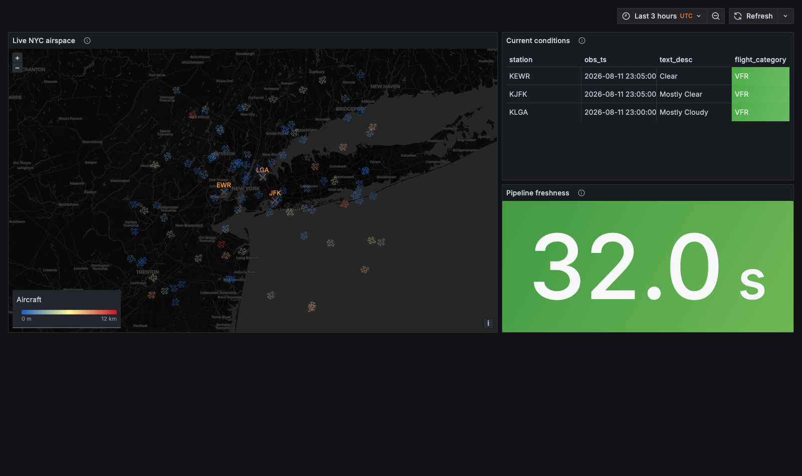

# SkyNYC

[](https://github.com/gil10101/skynyc/actions/workflows/ci.yml)

Real-time measurement of how weather degrades airport operations in the New York
terminal area — JFK, LaGuardia, and Newark.

The pipeline ingests live aircraft positions (OpenSky Network ADS-B) and official
weather observations and alerts (NOAA / National Weather Service), derives
operational events — **arrivals, holding patterns, go-arounds** — from raw
telemetry via stateful stream processing, validates the derived events against an
independent ground-truth source with a published precision/recall score, and
serves both a live dashboard and an analytical answer.

**The business question:** how much do arrival rates fall — and holding and
go-arounds rise — as conditions degrade from VFR to IFR, and which weather
variable (visibility, ceiling, wind/gusts) is the strongest leading indicator?

**What makes it interesting:** the operational events exist in no feed. They are
*derived* from position telemetry by per-aircraft state machines, then *validated*
daily against ground truth. The derive-and-validate loop — not the moving map —
is the point.

---

## The system, live


*The provisioned dashboard: heading-rotated aircraft colored by altitude around the three fields, per-station conditions with flight category, and the end-to-end freshness stat that doubles as the pipeline's liveness alarm.*

| | |
|---|---|
|  *The live query's statistics: rates, rows, and batch durations across hundreds of micro-batches* |  *A ground-truth run: 1,592 arrivals pulled, per-airport counts and API-credit accounting in the log* |
|  *The product no feed provides: derived arrivals and holding patterns* |  *The lake: partitioned Parquet archive plus database backups* |

---

## Architecture

```
 OpenSky /states/all ──┐                          ┌─▶ Parquet bronze ──▶ Azure ADLS Gen2
   poll 30s, credit    │    ┌──────────────┐      │   (dt=/hr=, immutable archive)
   guarded             ├───▶│ Kafka (KRaft) │──────┤
 NWS obs + alerts ─────┘    │ 3 topics      │      ├─▶ live_states  ──▶ Postgres ──▶ Grafana
   5min / 2min, unit-       │ 7d/30d        │      │   (10s upsert)                 (map, panels)
   code parsing             └──────┬────────┘      └─▶ flight_events
                                   │            Spark Structured Streaming
                                   │            (3 queries, checkpointed)
                            plain consumer ──▶ Postgres (weather_obs / weather_alerts)

 OpenSky /flights/arrival ──▶ Dagster (daily 09:15 ET) ──▶ arrivals_ground_truth
                                                            │
                              dbt: staging ──▶ marts ◀──────┘
                              (detection quality: precision / recall per day per airport)
```

| Component | Role | Honest scoping note |
|---|---|---|
| Python producers ×2 | Poll REST APIs, wrap in a typed envelope, publish to Kafka; own the OAuth2 token lifecycle and the API credit budget | Polling→Kafka is the standard bridge for poll-only sources |
| Kafka (single node, KRaft) | Durable buffer and 7-day replay log | Not here for throughput (~5 msg/s) — here because the upstream API serves at most 1 h of history, so the retained log is the only replay substrate detector tuning has |
| Spark Structured Streaming | Bronze archive, live-position upserts, and stateful per-aircraft event detection (`applyInPandasWithState`) | Single-node `local[*]` by design; the code is cluster-portable |
| Plain Python consumer | Weather topics → Postgres upserts | 3 messages per 5 minutes does not need distributed compute |
| Azure ADLS Gen2 | The lake: immutable bronze archive + nightly backups | Compute is disposable, storage is not — the one place cloud earns its keep here |
| Postgres 16 | Serving layer and warehouse | |
| dbt | Staging → marts; tests and source freshness double as pipeline monitoring | |
| Dagster | Batch only: daily ground-truth pull, scheduled builds | Streams are supervised by Docker restart policies — an orchestrator's run model is the wrong shape for an infinite process |
| Grafana OSS | Live geomap + operational panels, provisioned from files | The repo is the dashboard; UI edits are exported back or they die |

Runtime: a single 8 GB VPS running the full compose stack. The laptop is a
development machine only.

## Event detection

Per-aircraft state machines over a ring buffer of recent position samples,
keyed by transponder address (Kafka partitioning guarantees per-aircraft
ordering):

- **Arrival** — approach candidacy (near field, low, descending) confirmed by
  ground contact — or by *coverage loss on short final*, a verified real-world
  pattern: transponder contact commonly drops below ~450 m on approach.
  Confirmed via a 90-second state timeout.
- **Holding** — sustained turning (≥ 340° cumulative unwrapped track change
  within 8 minutes) without net displacement, inside the holding altitude/speed
  band, filtered to airline-class traffic.
- **Go-around** — descent on approach followed by a committed climb (two
  consecutive strong-climb samples and ≥ 200 m regained) with no touchdown.

Every threshold is a named constant; tuning happens by **replaying the retained
Kafka log** with adjusted values and re-scoring against ground truth — the
scores land in `mart_detection_quality` (grain: day × airport), targets
P ≥ 85% / R ≥ 80%.

Detectors are pure Python with no Spark dependency; the fixture suite runs the
exact production logic over **recorded live sequences** (a full BA descent into
JFK, a Delta flight vanishing at 83 m on LaGuardia final, overflights, taxi
traffic) plus disclosed synthetic geometry for patterns weather hasn't provided
yet.

## Project status

| Phase | Scope | Status |
|---|---|---|
| M0 Foundations | Compose stack, schema, topics, live smoke test | ✅ |
| M1 Ingestion | Producers with credit guard + unit-aware parsing, weather consumer, parser suite over recorded fixtures | ✅ |
| M2 Live map | Spark bronze→Azure + live positions, provisioned dashboard | ✅ |
| M3 Detection & validation | Detectors + fixture suite, ground-truth pull, quality mart | ✅ built & live · first P/R score pending first full detection day vs. nightly-batch ground truth |
| M4 Modeling | Full dbt DAG (hourly facts, weather join-at-read, impact mart), scheduled builds | — |
| M5 Dashboard & soak | Remaining panels, alert overlays, 7-day continuous run | — |
| M6 Analysis & packaging | The written answer, demo capture | — |

## Running it

Prerequisites and full walkthroughs live in `docs/` (PDF operator guides:
setup, operations, cloud deployment). The short version:

```bash
cp .env.example .env        # fill: OpenSky client id/secret, contact email
make up                     # kafka, postgres, grafana (+ schema on first boot)
make topics                 # three topics, correct retention
make smoke                  # live checks against both APIs — no mocks
make ingest                 # producers + weather consumer
make stream                 # spark: bronze + live + events
make batch                  # dagster (toggle the schedule on once, in the UI)
make dbt-build              # staging + quality mart, with tests
```

`make help` lists the operational targets (`credits`, `lag`, `psql`, `test`).

Deploying to a server: `scripts/deploy.sh` (any Ubuntu host, root or sudo user).
Azure lake provisioning: `scripts/provision_azure.sh`.

## Design decisions worth defending

- **Kafka at 5 msg/s** — replay is the feature. The API keeps one hour of
  history; the retained log is the only thing that makes threshold tuning
  possible at all.
- **Join-at-read, not stream-stream** — weather changes a few times an hour;
  events are enriched at query time with the observation valid at event time.
  A stream-stream join here would be architecture theater.
- **Docker supervises streams, Dagster supervises batch** — infinite processes
  are not jobs.
- **Units are load-bearing** — every NWS quantity is converted by reading its
  `unitCode` (wind arrives in km/h), never inferred from a field name.
- **Nulls are data** — position-less rows are counted and dropped at the bronze
  parse; on-ground aircraft legitimately report null altitude; coverage gaps
  are recorded as absence, never interpolated.
- **Idempotency everywhere** — deterministic event ids, upserts on natural
  keys: replays and crash-recovery cannot duplicate rows.
- **Loopback-bound ports** — Docker's iptables rules bypass host firewalls, so
  every published port binds `127.0.0.1`; remote access is an SSH tunnel.

## Data sources

- **OpenSky Network** — aircraft state vectors and arrival ground truth, used
  under their research/non-commercial terms.
  Bringing up OpenSky in publications: M. Schäfer, M. Strohmeier, V. Lenders,
  I. Martinovic, M. Wilhelm. *Bringing Up OpenSky: A Large-scale ADS-B Sensor
  Network for Research*. IPSN 2014.
- **NOAA / National Weather Service** — station observations and active
  alerts; US-government open data. Requests carry the required identifying
  `User-Agent`.

Total infrastructure cost: one small VPS (~$24–48/mo for the project's
lifetime) and object storage that rounds to pennies. Every other component is
open source; both data sources are free.

## Repository layout

```
producers/       OpenSky + NWS pollers, shared token/backoff/parsing/models
consumers/       weather → Postgres upserts
streaming/       Spark app (bronze / live / events) + pure-python detectors + sinks
orchestration/   Dagster: daily ground-truth asset, schedules
dbt/skynyc_dbt/  staging + marts (detection quality now; impact marts in M4)
db/init/         first-boot schema + numbered migrations
grafana/         provisioned datasource + dashboard (the repo is the dashboard)
scripts/         smoke test, fixture capture, Azure provisioning, VPS deploy
tests/           parser + detector suites over recorded live fixtures
docs/            operator guides (PDF): setup, operations, cloud
```
